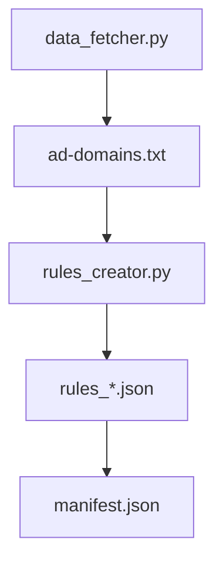

# BIAMP AD BLOCKER

> AD Blocker compatible with manifest V3 rule-based and static, meaning it won't send data anywhere using [StevenBlack](https://raw.githubusercontent.com/StevenBlack/hosts/refs/heads/master/hosts) hosts in order to block ads.


## Table of Contents

- [Overview](#overview)
- [Project Structure](#project-structure)
- [Rule Structure](#rule-structure)

## OVERVIEW

This extension is meant to block ads according to the new manifest V3. It works by using the ad dns domains, where we add the character "^" to json files, each domain with it's id, priority and action (all ad-domains have priority of 1, which is a low priority, but it wouldn't matter since they all have the same action which is block which gives them the same order of priority). It's safer than other extensions not only beacuse of the transperency of the code, but because it uses static rules meaning the code will never reach outside your browser or send data anywhere and it also follows the latest Manifest Version (V3) meaning it will be supported for a long period of time and offers better privacy and security compare to Manifest V2, where code could be hosted remotely and running long-lived background pages even when the extension wasn't running. The structures of how it works will be presented bellow.

## Project Structure




## Rule Structure

```json
{
    "id": incrementing integer,
    "priority": 1,
    "action": {
      "type": "block"
    },
    "condition": {
      "urlFilter": "cookie.domain.example^",
      "resourceTypes": [
        "main_frame",
        "sub_frame",
        "script",
        "image",
        "xmlhttprequest"
      ]
    }
  },
```
